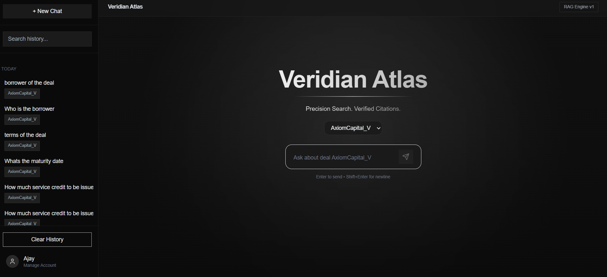
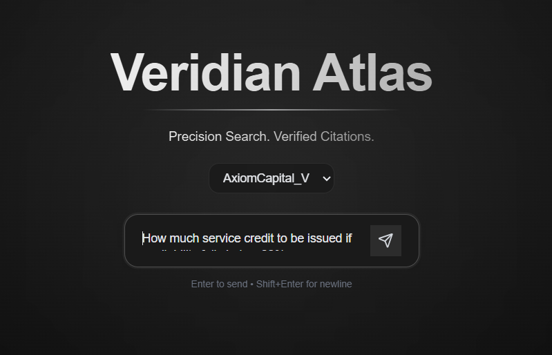
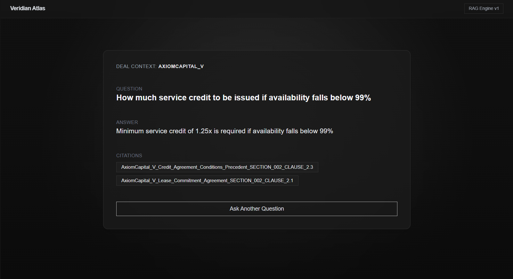
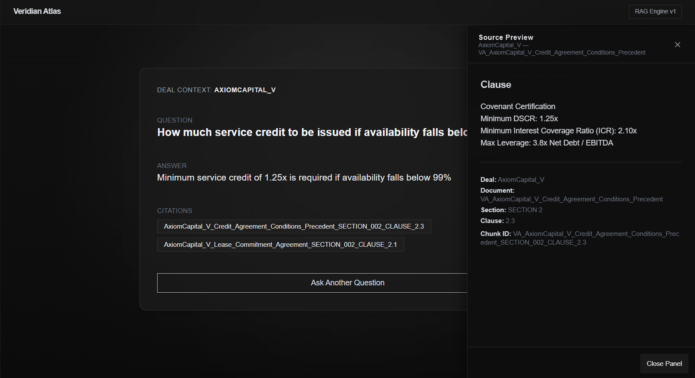

# Veridian Atlas
**Enterprise RAG for Deal Documents, Agreements & Clause Intelligence**

Veridian Atlas is a full-stack Retrieval-Augmented Generation (RAG) system that turns deal documents, credit agreements, fee schedules, and clause libraries into **searchable intelligence**. It runs a fully governed flow:

**Ingestion → Chunking → Embedding → Vector Indexing → Retrieval → Grounded Answering**

> This is not a chatbot. This is retrieval with governance — correctness, citations, and isolation between deals.

---

# Preview

### **Home / Landing Page**
Deal selection + onboarding UI



### **Ask a Question (RAG Query)**
User query → vector search → LLM with retrieved context  



### **Answer + Citations**
LLM answer is **only** from retrieved chunks 



### **Clause Source Panel**
Retrieved chunk viewer with metadata  



---

# System Architecture

Veridian Atlas follows a document-to-answer pipeline designed for **traceable, deal-isolated retrieval**.  
If it was not retrieved, it cannot be used in the answer.

📌 **Full architecture with flowcharts and diagrams:** [View Architecture Overview](docs/diagrams/ARCHITECTURE.md)


## 🔧 Pipeline Summary

```
Raw Docs → Ingestion → Chunking → Embeddings
           ↓                ↓
    JSON Sections      chunks.jsonl
           ↓                ↓
       Vector DB ← Index Build (Chroma)
           ↓
     Retrieval + LLM Answer (Cited)
```

| Layer | Technology |
|-------|-------------|
| Runtime | Python 3.11 |
| API | FastAPI |
| Embeddings | Sentence-Transformers |
| Vector Index | ChromaDB |
| UI | React + Vite + Tailwind |
| LLM | Local or remote (optional) |

---

# Project Structure
```
veridian-atlas/
├─ src/
│  ├─ veridian_atlas/         # Backend RAG engine
│  │  ├─ api/                 # FastAPI routes
│  │  ├─ cli/                 # CLI pipeline tools
│  │  ├─ data/                # Deals, processed chunks, vector DB
│  │  ├─ data_pipeline/       # ingestion/chunking/indexing
│  │  ├─ rag_engine/          # Retrieval + Answer pipeline
│  │  └─ utils/               # logging/helpers
│  └─ frontend/               # UI (React + Tailwind)
├─ docs/
│  └─ screenshots/            # UI images
└─ requirements.txt
```

---

# Backend Setup
```bash
python -m venv .venv
.venv\Scripts\activate
pip install -r requirements.txt

uvicorn veridian_atlas.api.server:app --reload --port 8000
```

API URL:  
```
http://127.0.0.1:8000
```

---

# Frontend Setup
```bash
cd src/frontend
npm install
```

Create `.env`:
```
VITE_API_URL=http://127.0.0.1:8000
```

Run:
```bash
npm run dev
```

---

# CLI Commands
```bash
python -m veridian_atlas.cli.run_project --reset
python -m veridian_atlas.cli.run_project --deal AxiomCapital_V
python -m veridian_atlas.cli.run_query --deal Blackbay_III --question "termination fees?"
```

---

# API Endpoints
| Method | Endpoint |
|--------|-----------|
| GET  | /deals |
| POST | /ask/{deal_id} |
| POST | /search/{deal_id} |
| GET  | /chunk/{deal_id}/{chunk_id} |

---

### Onboarding New Deals

To add your own credit agreements or contracts to the system:
➡️ Read the guide here: **[ADDING_NEW_DEALS.md](ADDING_NEW_DEALS.md)**.

---

# License
MIT — free to use, extend, or integrate.

---
